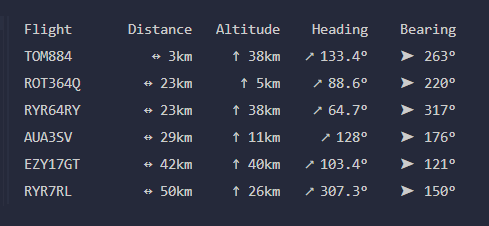

# Local Flight Radar

ADS-B flight radar built in Rust. It uses data from a local `dump1090-fa` instance to track nearby aircraft, filter them based on visibility from your window, and visualize them in your terminal.



## Features

- Pulls aircraft data from a local ADS-B JSON feed (`dump1090-fa`)
- Filters out invalid or distant flights
- Filters flights based on your window's viewing direction and field of view
- Computes distance, altitude, heading, and bearing for each flight
- Terminal-based visualization of flight direction and call signs

## Requirements

- local `dump1090-fa` instance accessible over HTTP (i.e. `http://192.168.1.x/skyaware/data/aircraft.json`)

## Installation

```bash
git clone https://github.com/tjardo/flightradar.git
cd flightradar
cp .env.example .env
cargo run
```

### Environment Variables

```ini
# COORDINATES
LATITUDE=52.XXXXX
LONGITUDE=5.XXXXX

# VIEW
WINDOW_DIRECTION=150.0
FIELD_OF_VIEW=100.0
MAX_DISTANCE_IN_KM=50.0

# API
API_URL=http://192.168.1.x/skyaware/data/aircraft.json
```

## Usage

### List View

This will show a list of all aircrafts that provide valid data and are within the optional `max_distance_in_km` parameter (defaults can be set in the `.env` file):

```bash
cargo run list --max_distance_in_km=50
```

### Window View

This will show a list of aircrafts that are within the `field_of_view` and `window_direction` parameters (defaults can be set in the `.env` file):

```bash
cargo run window --max_distance_in_km=10 --window_direction=150 --field_of_view=100
```
